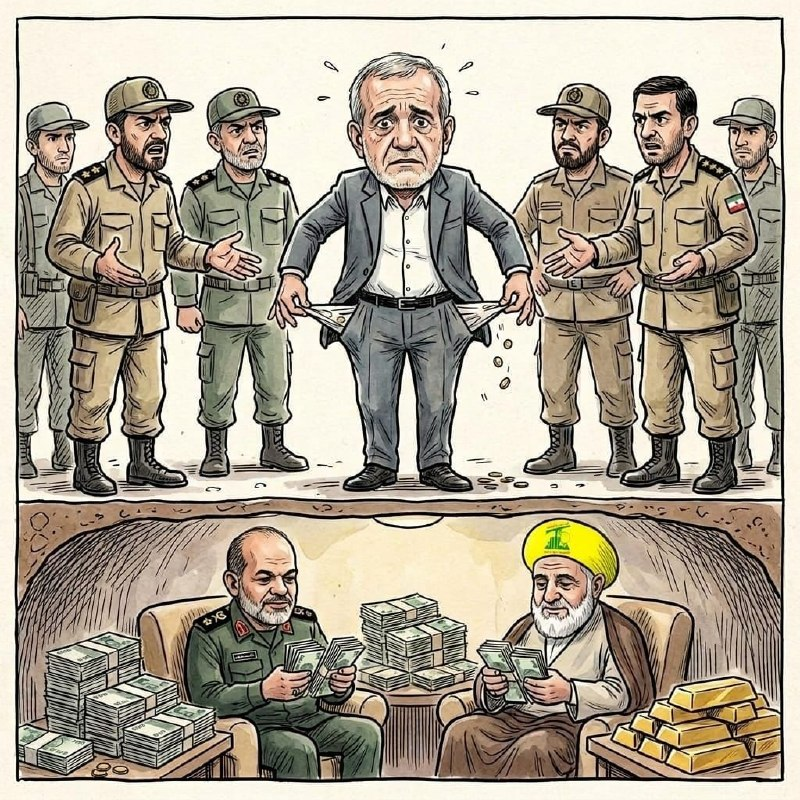

# خواننده تلگرام

<!-- TOP_NAV START -->

<a href="https://github.com/ProAlit/aio-downloader/blob/main/telegram/content/archive_1.md" style="display:inline-block; padding:6px 12px; margin:0 4px; background-color:#2ea44f; color:white; text-decoration:none; border-radius:4px; font-weight:bold;">صفحه بعد</a>

<!-- TOP_NAV END -->

<!-- MSG START -->

---
📅 بروزرسانی: 1405/02/21 18:23
---

## WithYashar — post 10934

ترامپ : در حال بررسی از سرگیری پروژه آزادی هستم، اما با دامنه گسترده‌تر که فقط به اسکورت کشتی‌ها از طریق تنگه هرمز محدود نشود.
@withyashar

## WithYashar — post 10933

ترامپ: تیم مذاکره‌کننده جمهوری اسلامی به ما گفت که آمریکا باید اورانیوم غنی‌شده را خارج کند، زیرا جمهوری اسلامی فناوری انجام این کار را ندارد
@withyashar

## mwarmonitor — post 8896

🔴 ترامپ به فاکس‌نیوز:
در حال بررسی ازسرگیری «پروژه آزادی» هستم، اما با دامنه‌ای گسترده‌تر که صرفاً به اسکورت کشتی‌ها از طریق تنگه هرمز محدود نباشد.

@mwarmonitor

## FoxNewsTwitter — post 341531

Fox News (Twitter/X)

JUST IN: Two passengers from the MV Hondius cruise ship who have been exposed to the deadly hantavirus outbreak arrive in Atlanta for medical care and assessments.

The passengers are reportedly being transported to Emory University Hospital, as health officials say both are asymptomatic and are following guidance from the Centers for Disease Control and Prevention.

## pm_afshaa — post 90551

🔴شبکه 14 اسرائیل، تو حمله بعدی اهدافمون شامل موارد زیر میشه:

تاسیسات انرژی و صنعت پتروشیمی

صنعت خودروسازی و پایگاه‌ های موشک بالستیک

صنعت نفت و صنعت فولاد

💧 Rainbet.com the #1 Non-KYC Crypto Casino & Sportsbook @rainbetcom

😁 @Pm_Afshaa

## VahidOnline — post 75405

قطع اینترنت نه تنها ربطی به تأمین امنیت زیرساخت‌ها ندارد، که «اقدام علیه امنیت ملی» است.
در ۷۲ روز گذشته میلیون‌ها گوشی، کامپیوتر و سرور ایرانی از صدها پچ امنیتی حیاتی محروم ماندند و در معرض انواع نفوذ و هک قرار گرفته‌اند.
در این #رشتو بخشی از این آپدیتها را مرور می‌کنم: @hamedbd_channel

hamedbd

📡 @VahidOnline

## FarsiVOA — post 217444

  <a href="telegram/content/FarsiVOA_217444_1778511184.mp4" target="_blank">🎬 Download video</a>

گلایه یک شهروند از گرانی روزافزون روغن و مواد خوراکی؛ «سپاه ما را به خواری و ذلت انداخته.»

در سایه بی‌ثباتی اقتصادی و فشارهای مداوم، زندگی روزمره بسیاری از مردم به میدان مبارزه‌ای خاموش برای تأمین حداقل‌ها تبدیل شده است.

## DW_Farsi — post 124565

  

🔶 کاهش شدید صادرات آلمان به خاورمیانه در پی جنگ

بر اساس ارزیابی خبرگزاری رویترز بر پایه نخستین داده‌های اداره فدرال آمار آلمان، در پی جنگ در خاورمیانه، صادرات به ایران در ماه مارس در مقایسه با ماه مشابه سال گذشته، ۶۷ درصد کاهش یافت و به کمتر از ۲۵ میلیون یورو رسید.

صادرات به کشورهای همسایه ایران در منطقه خلیج فارس نیز به شدت کاهش یافت.

صادرات به قطر با افتی نزدیک به ۶۰ درصد به حدود ۵۴ میلیون یورو رسید و صادرات به عراق با ۵۵ درصد کاهش به ۵۸ میلیون یورو رسید.

صادرات به کویت نیز با ۵۸ درصد کاهش به حدود ۴۴ میلیون یورو سقوط کرد و صادرات به عربستان سعودی با بیش از ۱۳ درصد کاهش به ۶۴۳ میلیون یورو رسید.

حجم تجارت با امارات متحده عربی نیز بیش از ۳۸ درصد کاهش یافت و به ۵۸۲ میلیون یورو رسید.

در عین حال صادرات به عمان ۱۷ درصد کاهش یافت و به کمتر از ۴۵ میلیون یورو و حجم صادرات به بحرین نیز با ۶۴ درصد افت به ۱۴.۲ میلیون یورو رسید.

طبق آمار منتشر شده، صادرات آلمان به این هشت کشور یادشده در ماه مارس به کمتر از ۱.۵ میلیارد یورو رسیده است. این رقم ۷۵۷ میلیون یورو کمتر از مدت مشابه در سال گذشته بوده است.
@dw_farsi

## IranianMinds — post 19943

  

🔴جمهوری اسلامی ورشکسته شده و قادر به پرداخت حقوق به مزدوران داخلی خود نیست...

@IranianMinds

## BBCPersian — post 280770

  

🔻مردی که به تیراندازی در هتل محل ضیافت خبرنگاران کاخ سفید در واشنگتن متهم شده است، اتهامات را رد کرد و در دادگاه اعلام بی‌گناهی کرد. این اتفاق دو هفته پیش رخ داد و ماموران سرویس مخفی آمریکا به‌سرعت دونالد ترامپ و همسرش و مقا‌های ارشد دولت را به محل امن بردند.

کول توماس آلن، ۳۱ ساله، به جرایم فدرال مرتبط با سلاح گرم و تلاش برای ترور دونالد ترامپ، رئیس‌جمهوری آمریکا، متهم شده است.

به گزارش شبکه سی‌بی‌اس، شریک خبری بی‌بی‌سی در آمریکا، آقای آلن روز دوشنبه با لباس نارنجی زندان و در حالی که دست‌ها و پاهایش زنجیر شده بود، در دادگاه حاضر شد.

کول توماس آلن در رشته مهندسی مکانیک در مؤسسه فناوری کالیفرنیا، یک دانشگاه بسیار معتبر، تحصیل کرده است.

دادستان‌ها می‌گویند او تلاش کرد از یک ایست بازرسی عبور کند و در مراسم در هتل هیلتون واشنگتن به یک مأمور سرویس مخفی آمریکا شلیک کرده است. جلیقه ضدگلوله‌اش جان این مامور را نجات داد.

ادامه خبر را از لینک زیر در وبسایت بی‌بی‌سی فارسی بخوانید.
📷 Reuters
https://bbc.in/4djpGT5
@BBCPersian

## idfinfarsi — post 11563

  <a href="telegram/content/idfinfarsi_11563_1778511188.mp4" target="_blank">🎬 Download video</a>

نیروهای لشکر ۱۴۶ یک انبار تسلیحاتی را هدف قرار داده و نیروهای حزب‌الله را که تهدیدی برای نیروهای ما بودند، به‌ هلاکت ‌رساندند

ارتش اسرائیل به اقدام برای رفع تهدیدها علیه شهروندان این کشور و نیروهای ارتش در جنوب لبنان ادامه می‌دهد.

نیروهای لشکر ۱۴۶ دیروز (یکشنبه) دو تروریست وابسته به سازمان تروریستی حزب‌الله را که وارد ساختمانی در نزدیکی نیروهای ما در جنوب لبنان شده بودند، شناسایی کردند. از داخل این ساختمان، این تروریست ها برای پیشبرد طرحی تروریستی علیه نیروهای ارتش اسرائیل که در منطقه فعالیت می‌کنند، اقدام می‌کردند.

بلافاصله پس از شناسایی، نیروی هوایی با هدایت نیروهای لشکر، این تروریست ها را که در ساختمان فعالیت داشتند، هدف قرار داده و به هلاکت رساند.

همچنین زیرساخت‌ها و یک انبار تسلیحاتی که مورد استفاده سازمان تروریستی حزب‌الله بود، هدف قرار گرفت و تروریست های دیگری که تهدیدی برای نیروهای ما بودند نیز به هلاکت رسیدند.

علاوه بر این، در ساعات اخیر سازمان تروریستی حزب‌الله چندین راکت و پهپاد انفجاری به سوی نیروهای ارتش اسرائیل در جنوب لبنان شلیک کرد.
در جریان این رویدادها، دو پهپاد انفجاری به تجهیزات مهندسی بدون سرنشین اصابت کردند. هیچ‌گونه تلفات جانی برای نیروهای ما گزارش نشده است، اما به تجهیزات خسارت وارد شده است.

ارتش اسرائیل به اقدام برای رفع تهدیدها علیه نیروهای خود و شهروندان این کشور ادامه خواهد داد.

## alonews — post 119304

  <a href="telegram/content/alonews_119304_1778511190.webm" target="_blank">🎬 Download video</a>

👈ترامپ: ایران گفته که آمریکا باید گرد و غبار هسته‌ای رو پاک کنه، چون خودشون وسایلشو ندارن

✅ @AloNews خبر جنگ

## alonews — post 119303

  <a href="telegram/content/alonews_119303_1778511190.webm" target="_blank">🎬 Download video</a>

👈ترامپ: از سرگیری پروژه آزادی در تنگه هرمز را بررسی می‌کنم

✅ @AloNews خبر جنگ

<!-- MSG END -->

<!-- NAV START -->

<a href="https://github.com/ProAlit/aio-downloader/blob/main/telegram/content/archive_1.md" style="display:inline-block; padding:6px 12px; margin:0 4px; background-color:#2ea44f; color:white; text-decoration:none; border-radius:4px; font-weight:bold;">صفحه بعد</a>

<!-- NAV END -->
